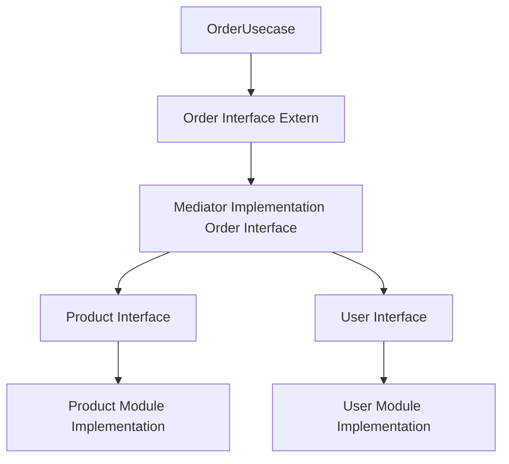

# Monolitic App Study

## 🖐️ Arquitetura do Projeto

Este projeto explora a construção de um **monólito modular**, organizado por pacotes de domínio independentes. Cada pacote encapsula suas próprias entidades, serviços e regras de negócio, promovendo alta coesão e baixo acoplamento.

Principais princípios adotados:
- **Separacão de Domínios:** Cada módulo (`user`, `auth`, `product`, `order`, etc.) é autônomo.
- **Comunicação desacoplada:** A interação entre pacotes acontece via um Mediator interno.
- **Processamento flexível:** O fluxo de criação de pedidos utiliza um Chain of Responsibility especializado.

---

## 🔗 Comunicação entre Pacotes (Mediator)

A comunicação entre diferentes pacotes é feita via um **Mediator interno**, que atua como um barramento leve para envio de comandos e eventos.

Por que usar Mediator?
- **Evita dependências diretas** entre os pacotes.
- **Facilita a manutenção** e evolução dos domínios de forma isolada.
- **Torna natural uma futura migração para microsserviços**, já que a comunicação já é desacoplada.

### Exemplo de Fluxo Mediator:




- `Order Usecase` envia comandos através do `Mediator`.
- O `Mediator` direciona para o `Product Interface` ou `User Interface` conforme o tipo de comando.
- O Módulo expõe suas interfaces conforme demanda e executa suas próprias implementações, garantindo total controle sobre o dominio. 

---

## ⚙️ Fluxo de Processamento de Orders (OrderProcessChain)

O fluxo de processamento de pedidos (órdens) é construído através de um Chain of Responsibility altamente especializado chamado **OrderProcessChain**.

Cada etapa de processamento é representada por uma implementação de `OrderHandlerChain`, registrada dinamicamente em uma lista.

### Exemplo de como o Chain funciona

```kotlin
for (handler in handlers) {
    currentContext = handler.handle(currentContext)
    if (!currentContext.isValid) break
}
return currentContext
```

Cada Handler possui a responsabilidade de:
- Executar uma única etapa (ex: validação de usuário, validação de produtos, cálculo de preço, etc.).
- Adicionar erros ao contexto em caso de falhas.
- Permitir a interrupção imediata do fluxo caso necessário.

### OrderDraft

Durante o processamento, as informações são construídas em um objeto chamado **OrderDraft**:

- Acumula dados como usuário, produtos, valores parciais e totais.
- Permite que cada handler adicione informações sem persistir nada prematuramente.
- É convertido para a entidade `Order` apenas ao final, garantindo consistência.

Benefícios:
- **Evita gravação parcial** em caso de falhas.
- **Contexto enriquecido** para as etapas de processamento.
- **Facilita rollback** em falhas sem necessários recursos transacionais complexos.

---

## 🏠 Monólito Modular: Por que essa abordagem?

A escolha de um **Monólito Modular com Mediator** se deu pelos seguintes motivos:

- **Velocidade de entrega:** Um único deploy inicial é mais simples de administrar.
- **Simplicidade operacional:** Sem sobrecarga de redes distribuídas.
- **Isolamento de contexto:** Cada módulo já é autônomo e testável.
- **Facilidade de evolução para microsserviços:**
    - Cada módulo pode ser extraído com mínima dependência.
    - Mediator pode ser trocado por comunicação assíncrona ou REST/gRPC.

### Vantagens na transição para Microserviços:

- **Separar facilmente** domínios como `order-service`, `user-service`, `product-service`.
- **Escalar domínios** individualmente conforme a demanda.
- **Aumentar a resiliência** usando comunicação assíncrona entre serviços.

---

## 🛠️ Tecnologias e Padrões

- **Kotlin** com **Spring Boot**
- **PostgreSQL** para persistência
- **Spring Data JPA** para ORM
- **Mediator Pattern** para comunicação interna
- **Chain of Responsibility** especializado para Order Processing
- **Arquitetura Modular** para separação de domínios

---

## ✨ Considerações Finais

Este projeto é focado no estudo de boas práticas arquiteturais para monólitos modulares, preparando terreno para uma evolução futura fluida em sistemas distribuídos.

A proposta é obter o melhor dos dois mundos: simplicidade inicial e escalabilidade futura.

Sempre que houver um tempo vou incrementando novas features e tornando ele mais complexo para conseguir estudar e validar cenários mais próximos de um case real.

